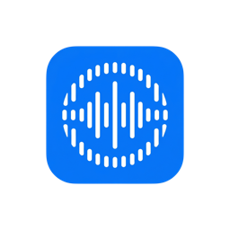

  

<h1 align="center">AudioMaster</h1>

  <strong>The free, open-source audio control center for macOS.</strong> 
  Per-app volume · Equalizer · Device switching · Routing presets · Menu bar control

  <a href="#features">Features</a> •
  <a href="#installation">Installation</a> •
  <a href="#how-it-works">How It Works</a> •
  <a href="#roadmap">Roadmap</a> •
  <a href="#support">Support</a>

---

## Features

### Per-App Volume Control

Control the volume of every app independently. Lower Slack notifications while keeping Spotify loud, mute a browser tab without affecting anything else — all from one place.

- Individual volume slider for each running app
- One-click mute per app
- Remembers your volume preferences across restarts
- Real-time detection of audio-playing apps (playing apps float to the top)
- Search/filter apps by name in the Apps tab
- Playing-app count in the Apps tab and menu bar popover
- Powered by Core Audio Process Taps (macOS 14.2+)

### Audio Device Management

See all your connected audio devices at a glance and switch between them instantly.

- View all output and input devices in one unified list
- One-click device switching (no more digging into System Settings)
- Collapsible Output / Input sections to keep things tidy
- Device details: type, manufacturer, channels, sample rate
- Automatic detection when devices are plugged in or removed
- Current default output highlighted in the Devices header

### Bluetooth Battery Status

Keep an eye on wireless audio accessories without leaving AudioMaster.

- Live battery badges on Bluetooth audio devices in the device list and menu bar popover
- Battery level shown in expanded device details
- Automatic refresh while AudioMaster is running
- Backend support for connect/disconnect and per-component AirPods readings (L/R/case) ready for upcoming UI

### Equalizer

Shape your sound with a real-time graphic equalizer — globally or per app.

- Global EQ applied to all audio output
- Per-app EQ to fine-tune individual apps independently (toggle in Preferences, edit from the Apps tab)
- Selectable band resolution: Standard (15), Extended (20), Fine (25), Pro (31)
- ±12 dB gain per band, logarithmically spaced 20 Hz – 20 kHz
- 15 built-in presets: Flat, Bass Boost, Treble Boost, Vocal, Pop, Rock, Jazz, Classical, Hip-Hop, Electronic, Acoustic, Podcast, Loudness, Warm, Bright
- One-click reset to flat, with settings remembered across restarts

### Menu Bar Control

AudioMaster lives in your menu bar — always accessible, never in the way.

- Quick popover with app volumes and device switching
- Master volume control
- Compact view of currently playing apps
- Click the menu bar icon to access everything without opening a window

### Routing Presets

Save a whole audio setup and bring it back with one click.

- Capture your current output device, master volume, per-app volumes & mutes, and global EQ as a named preset
- Apply a preset instantly to reproduce a setup like Work, Gaming, or Music
- Update a preset to the current setup, rename, or delete
- Presets only restore what they captured and skip anything unavailable (unplugged device, closed app)
- Saved across restarts

### Keyboard Shortcuts

Adjust volume without reaching for the mouse.

- `⌘⌥↑` / `⌘⌥↓` raise and lower the volume of the last app you adjusted
- Works globally while AudioMaster is running
- Toggle on or off in Preferences
- Arrow-key nudging on focused volume sliders in the window

### Lightweight & Non-Intrusive

- Launches as a **menu bar icon only** — no Dock clutter, no window popping up
- First launch guides you through setup with an onboarding sequence
- Optionally open the full window on launch (configurable in Preferences)
- Click the Dock icon or use the popover to open the full window when needed
- Adaptive background polling so idle resource use stays low

### Preferences

- Launch at login
- Show/hide menu bar icon
- Open window on launch (off by default)
- Remember app volumes across sessions
- Default volume for newly detected apps
- Configurable volume curve (linear or logarithmic)
- dB display option
- Volume keyboard shortcuts on/off
- Appearance: System, Light, or Dark
- Scheduled update checks + in-app DMG download with progress
- Equalizer controls (global EQ, per-app EQ, band resolution, presets)
- Debug logging and reset-to-defaults

---

## Installation

### Requirements

- macOS 14.2 (Sonoma) or later
- Universal binary: runs natively on Apple Silicon and Intel

### Download

Download the latest `.dmg` from [GitHub Releases](https://github.com/GabryeleSantoro/AudioMaster/releases).

---

## How It Works

1. **Launch** — AudioMaster starts as a menu bar icon. On first launch, you'll be guided through a quick setup.
2. **Control volumes** — Click the menu bar icon to see all apps playing audio. Drag sliders to adjust individual volumes.
3. **Switch devices** — Expand the Output section in the popover or open the full window to switch your audio device instantly.
4. **Tune the sound** — Enable the equalizer to shape output globally or per app. Pick a preset or adjust bands by hand.
5. **Save setups** — Capture Work / Gaming / Music as routing presets and restore them whenever you need them.
6. **Forget about it** — AudioMaster remembers your preferences. It stays out of the way until you need it.

---

## Roadmap

### Shipped

| Status | Feature                                            |
| ------ | -------------------------------------------------- |
| ✅     | Per-app volume control (Process Tap)               |
| ✅     | App search/filter & playing-app indicators         |
| ✅     | Audio device switching (output & input)            |
| ✅     | Menu bar popover with quick controls               |
| ✅     | Device hot-plug detection                          |
| ✅     | Volume persistence across restarts                 |
| ✅     | Bluetooth battery badges on audio devices          |
| ✅     | Global & per-app equalizer with presets            |
| ✅     | Scheduled update checks + in-app DMG download      |
| ✅     | Volume keyboard shortcuts                          |
| ✅     | Audio routing presets (save & restore setups)      |
| ✅     | Appearance themes (System / Light / Dark)          |
| ✅     | Onboarding & launch preferences                    |

### In progress

| Status | Feature                                            |
| ------ | -------------------------------------------------- |
| 🔜     | Audio normalization (global LUFS loudness leveling)|

### Planned — UX improvements

Ideas that would make day-to-day use faster, clearer, and more automatic:

| Status | Feature | Why it helps |
| ------ | ------- | ------------ |
| 📋     | Dedicated Bluetooth panel (list, connect/disconnect, L/R/case battery) | Manage accessories without opening System Settings |
| 📋     | Show only playing / hide idle apps | Less clutter when many apps are open |
| 📋     | Pin / favorite apps | Keep Slack, browser, or DAW always visible |
| 📋     | Customizable global shortcuts | Remap hotkeys; add mute-last-app, cycle device, apply preset |
| 📋     | Quick Switcher (⌘K-style) | Jump to any app, device, or preset from the keyboard |
| 📋     | Context-aware / Focus Mode presets | Auto-apply Gaming when a game launches, Meeting when Zoom joins |
| 📋     | Per-device default volume & EQ | Headphones quieter than speakers the moment you plug in |
| 📋     | Soft mute / fade transitions | Avoid abrupt silence when muting or switching devices |
| 📋     | Peak / loudness meters | Visual feedback so you know what’s actually playing |
| 📋     | Now Playing + media keys in the popover | Pause/skip without leaving AudioMaster |
| 📋     | Audio ducking during calls | Lower music automatically when the mic is active |
| 📋     | Export / import presets | Share setups across Macs or with teammates |
| 📋     | Multi-output routing | Send one app to headphones and speakers at once |
| 📋     | iCloud sync for presets & volumes | Same setups on every Mac |
| 📋     | Localization | Native UI language for non-English users |
| 📋     | Menu bar Control Center / widget | Glanceable volume without opening the popover |

---

## Support

AudioMaster is **100% free** and open source. If you find it useful, consider buying me a coffee to support ongoing development.

Found a bug or have an idea? Please [open an issue](https://github.com/GabryeleSantoro/AudioMaster/issues) — bug reports and feature requests are welcome and help shape the roadmap.

  

---

## License

This project is open source. See [LICENSE](LICENSE) for details.

---

  Made with ❤️ for the Mac community

